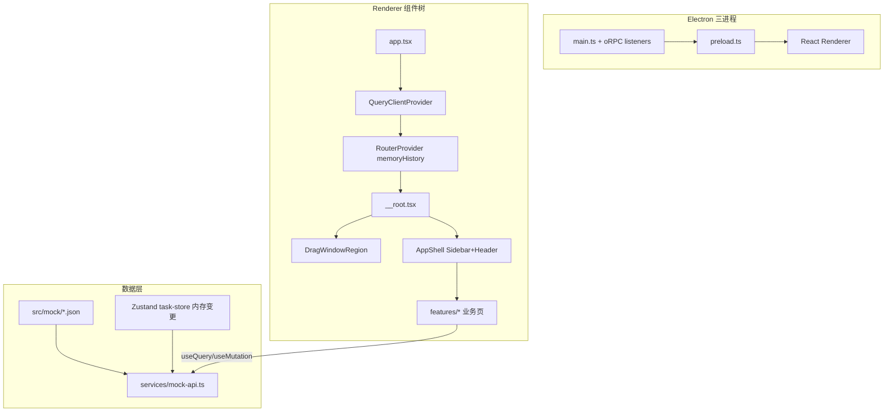

# AutoTask Studio MVP Mock UI 实施计划

## 现状与目标差距

| 维度 | 当前状态 | PRD 目标 |
|------|----------|----------|
| 工程 | [`autotask-studio/`](autotask-studio/) 为未改名的 electron-shadcn 模板 | AutoTask Studio 桌面客户端 |
| 路由 | 仅 `/`、`/second` 两条演示路由 | 13 条业务路由 + `/ → /dashboard` |
| 布局 | [`base-layout.tsx`](autotask-studio/src/layouts/base-layout.tsx) 仅含标题栏 + main | Sidebar + Header + AppShell |
| 数据 | 无 mock 层 | `src/mock/*.json` + `mockApi` |
| 依赖 | 缺 zustand、react-table、cmdk、sonner、react-hook-form | PRD §2.3 技术栈 |

仓库内已有 [`reference-shadcn-admin/`](reference-shadcn-admin/) 作为 UI 模式参考，**复制并裁剪**其布局、DataTable、Command 等组件，而非从零手写。

---

## 架构设计



### 关键集成决策

**1. 双层布局（保留 Electron 不变量）**

- **外层** [`base-layout.tsx`](autotask-studio/src/layouts/base-layout.tsx)：保留 `DragWindowRegion`（`titleBarStyle: hidden` 必需），标题改为 `AutoTask Studio`
- **内层** 新建 `src/components/layout/app-shell.tsx`：参考 [`reference-shadcn-admin/src/components/layout/authenticated-layout.tsx`](reference-shadcn-admin/src/components/layout/authenticated-layout.tsx)，组合 `AppSidebar` + `Header` + `<Outlet/>`
- **不做真实登录**：跳过 shadcn-admin 的 `_authenticated` 路由守卫与 `auth-store`

**2. 主题双轨合一**

- 保留 electron-shadcn 的 [`actions/theme.ts`](autotask-studio/src/actions/theme.ts)（IPC + `localStorage` + `document.documentElement.classList`）
- Header 中的主题切换复用/扩展现有 [`toggle-theme.tsx`](autotask-studio/src/components/toggle-theme.tsx)，**不引入** shadcn-admin 的 cookie `ThemeProvider`（与 Electron 原生主题不同步）

**3. 路由：文件路由 + memory history**

- 沿用现有 [`utils/routes.ts`](autotask-studio/src/utils/routes.ts) 的 `createMemoryHistory`（Electron `file://` 不变量）
- 在 `src/routes/` 下按 PRD §12 新增文件路由；`routeTree.gen.ts` 由 Vite 插件自动生成，**禁止手改**

**4. Feature 切片结构（参考 shadcn-admin）**

```
src/
├── routes/           # 薄路由层，仅 createFileRoute + 引用 feature
├── features/         # 业务页面（dashboard、tasks、workflows...）
├── components/
│   ├── layout/       # app-shell, sidebar, header, sidebar-data
│   ├── business/     # PRD §10.1 业务组件
│   ├── common/       # PRD §10.2 通用组件
│   └── ui/           # shadcn 组件（从 reference 复制）
├── mock/             # JSON 数据
├── services/         # mock-api.ts
├── types/            # 业务类型
└── stores/           # Zustand（任务内存变更）
```

**5. Mock 数据 + 可变状态**

- 初始数据从 JSON 加载；`mockApi` 统一封装，页面**禁止直接 import JSON**
- 新建任务、状态切换等写操作通过 **Zustand `task-store`** 维护内存覆盖层，`mockApi` 读取时 merge JSON 基线 + store 变更
- `mockApi` 所有方法返回 `Promise`，可加可配置延迟（settings 中的 Mock 延迟）

---

## 依赖安装

在 [`autotask-studio/package.json`](autotask-studio/package.json) 新增：

| 包 | 用途 |
|----|------|
| `zustand` | 任务创建/状态 mock 变更 |
| `@tanstack/react-table` | DataTable |
| `react-hook-form` + `@hookform/resolvers` | 新建任务/设置表单 |
| `cmdk` | 全局 Command 搜索 |
| `sonner` | Toast 反馈 |
| `date-fns` | 日期筛选（可选） |

通过 `npx shadcn@canary add` 补充 UI：`sidebar`, `table`, `badge`, `tabs`, `card`, `dialog`, `dropdown-menu`, `select`, `input`, `form`, `sheet`, `scroll-area`, `separator`, `tooltip`, `progress`, `sonner`, `command` 等。

---

## 从 reference-shadcn-admin 复用清单

| 来源路径 | 目标用途 | 裁剪说明 |
|----------|----------|----------|
| `components/ui/sidebar.tsx` | 侧边栏基础 | 直接复制 |
| `components/layout/app-sidebar.tsx` + `sidebar-data.ts` | 8 项导航菜单 | 替换为 PRD §5 菜单项 |
| `components/layout/header.tsx` | 页面 Header | 去掉 Clerk/Profile，加 Worker 状态 |
| `components/data-table/*` | 表格工具栏/分页/筛选 | 去掉 URL 同步或简化（Electron memory history 下 URL 不可分享，**表格状态用组件 state 即可**，不必强制 `useTableUrlState`） |
| `features/tasks/` | 任务列表模式 | 重写列定义与数据源 |
| `context/search-provider.tsx` + `command.tsx` | 全局搜索 | 搜索 mock 任务/模板/门户 |
| `features/settings/` | 设置页 Tab 布局 | 替换为 PRD §9.13 字段 |

---

## 分轮实施（对齐 PRD §13）

### 第一轮：项目改名与基础布局

**目标**：可启动的 AutoTask Studio 壳，左侧 8 项导航，右侧空页面占位。

- 重命名：`package.json` name/productName、`base-layout.tsx` 标题、i18n `appName`、`forge.config.ts` publisher
- 新建布局组件：
  - [`src/components/layout/app-shell.tsx`](autotask-studio/src/components/layout/app-shell.tsx)
  - [`src/components/layout/sidebar.tsx`](autotask-studio/src/components/layout/sidebar.tsx)（或 `app-sidebar.tsx`）
  - [`src/components/layout/header.tsx`](autotask-studio/src/components/layout/header.tsx)
  - [`src/components/layout/data/sidebar-data.ts`](autotask-studio/src/components/layout/data/sidebar-data.ts)
- 修改 [`__root.tsx`](autotask-studio/src/routes/__root.tsx)：BaseLayout 内嵌 AppShell
- 配置 13 条路由占位页 + `index.tsx` 重定向 `/dashboard`
- 删除模板演示页 `second.tsx`、顶部 `navigation-menu.tsx`
- 在 [`app.tsx`](autotask-studio/src/app.tsx) 挂载 `QueryClientProvider` + `Toaster`

**路由文件规划：**

```
src/routes/
├── index.tsx              → redirect /dashboard
├── dashboard.tsx
├── tasks/
│   ├── index.tsx
│   ├── new.tsx
│   └── $taskId.tsx
├── workflows/
│   ├── index.tsx
│   └── $workflowId.tsx
├── components.tsx
├── srm-portals/
│   ├── index.tsx
│   └── $portalId.tsx
├── runs/
│   ├── index.tsx
│   └── $runId.tsx
├── artifacts.tsx
└── settings.tsx
```

---

### 第二轮：Mock 数据与类型

**目标**：统一数据访问层，所有页面可 `useQuery` 拉取 mock 数据。

- 新建 [`src/types/`](autotask-studio/src/types/)：`automation-task.ts`, `workflow.ts`, `task-run.ts`, `srm-portal.ts`, `artifact.ts`, `worker.ts`, `dashboard.ts`, `settings.ts`（对应 PRD §7）
- 新建 10 个 JSON 文件（PRD §6 + §8 示例数据扩展至可演示规模，每类 5~10 条）
- 新建 [`src/services/mock-api.ts`](autotask-studio/src/services/mock-api.ts)
- 新建 [`src/stores/task-store.ts`](autotask-studio/src/stores/task-store.ts)（任务 CRUD + 状态变更）
- 新建通用组件：`mock-loading.tsx`, `empty-state.tsx`
- 各占位页接入 `useQuery`，展示 loading/empty

---

### 第三轮：Dashboard

**路由**：`/dashboard` → `features/dashboard/`

| 模块 | 组件 | 数据源 |
|------|------|--------|
| 统计卡片 ×7 | `StatCard` | `dashboard.json` |
| 当前执行队列 | DataTable | `tasks.json` 筛选 RUNNING/QUEUED |
| 待人工处理 | DataTable | status=WAITING_HUMAN |
| 最近失败 | DataTable | status=FAILED |
| Worker 状态 | `worker-status-card.tsx` | `workers.json` |
| 任务类型分布 | 简易柱状/列表 | dashboard.json |

操作按钮（查看/执行/暂停等）调用 `task-store` mock 方法 + toast。

---

### 第四轮：任务模块

**路由**：`/tasks`, `/tasks/new`, `/tasks/$taskId`

| 页面 | 关键实现 |
|------|----------|
| 列表 | 筛选栏 + 状态 Tabs + DataTable + 批量操作；[`status-badge.tsx`](autotask-studio/src/components/business/status-badge.tsx)、[`priority-badge.tsx`](autotask-studio/src/components/business/priority-badge.tsx)、[`progress-cell.tsx`](autotask-studio/src/components/business/progress-cell.tsx) |
| 新建 | react-hook-form + zod；选模板后按 `inputSchema` 动态渲染字段；保存写入 `task-store` |
| 详情 | 三栏布局：[`step-timeline.tsx`](autotask-studio/src/components/business/step-timeline.tsx) + [`run-log-panel.tsx`](autotask-studio/src/components/business/run-log-panel.tsx) + [`artifact-preview.tsx`](autotask-studio/src/components/business/artifact-preview.tsx)；底部审计日志表 |

Mock 行为（PRD §9.4）：执行→RUNNING+进度模拟；暂停→WAITING_HUMAN；重试→QUEUED；标记完成→SUCCESS。

---

### 第五轮：流程模板模块

**路由**：`/workflows`, `/workflows/$workflowId`

- 列表：DataTable（名称/编码/分类/版本/状态/步骤数）
- 详情/编辑：左侧配置导航 Tab（基础信息/输入参数/步骤配置/错误处理/Mock YAML/测试运行）
- [`workflow-step-card.tsx`](autotask-studio/src/components/business/workflow-step-card.tsx) + Step Timeline
- Mock YAML 区：只读 `<pre>` 展示 workflow JSON 转 YAML 格式

---

### 第六轮：SRM 与 RPA 组件库

**路由**：`/components`, `/srm-portals`, `/srm-portals/$portalId`

- RPA 组件库：分类 Tabs + 卡片网格（6 类 × 多组件）
- SRM 列表：DataTable + [`srm-portal-card.tsx`](autotask-studio/src/components/business/srm-portal-card.tsx)
- SRM 详情：5 个 Tab（基础信息/登录配置/页面定位器/字段映射/测试记录）；密码字段显示 `********`

---

### 第七轮：运行监控与证据中心

**路由**：`/runs`, `/runs/$runId`, `/artifacts`

- 运行监控：Worker 卡片组 + 运行队列 + 历史记录 + 失败重试列表
- 运行详情：StepRun Timeline + 日志面板（级别筛选 + 自动滚动）+ 右侧 Artifact/元数据
- 证据中心：筛选 + DataTable + 预览 Dialog（截图占位图、PDF/Trace/DOM/Log 占位内容）

---

### 第八轮：系统设置与整体 Polish

**路由**：`/settings`

- 6 个 Tab 设置表单（react-hook-form）；外观 Tab 联动现有 `setTheme()`
- Header：全局 Command 菜单（搜索任务/模板/门户/运行记录）
- Header 右侧：Worker 聚合状态（Online/Busy/Offline）
- 统一 `page-header.tsx`、`page-toolbar.tsx`、`confirm-dialog.tsx`
- 空状态、loading、toast 反馈全覆盖
- 删除残留模板代码；中文 UI 文案

---

## Electron 不变量检查清单

实施全程需保持（来自 [`docs/electron-shadcn.md`](docs/electron-shadcn.md)）：

- `contextIsolation: true`，新能力走 oRPC/IPC 三文件模式
- `createMemoryHistory` 不改为 browser history
- `DragWindowRegion` 保留在根布局
- 主题变更走 `actions/theme.ts` 的 `setTheme()` / `toggleTheme()`
- React Compiler ESLint 规则合规，避免手动 `useMemo`/`useCallback` 反模式
- shadcn `ui/` 组件通过 CLI 添加，不手改生成文件

---

## 验收对照（PRD §14）

| # | 标准 | 对应轮次 |
|---|------|----------|
| 1 | Electron 可启动 | 第一轮 |
| 2 | 左侧导航完整 | 第一轮 |
| 3 | Dashboard mock 数据 | 第三轮 |
| 4 | 任务列表可筛选、看详情 | 第四轮 |
| 5 | 可创建 mock 任务 | 第四轮 |
| 6 | 任务详情步骤/日志/证据 | 第四轮 |
| 7 | 流程模板参数与步骤 | 第五轮 |
| 8 | SRM locator/字段映射 | 第六轮 |
| 9 | 运行监控 Worker/Run | 第七轮 |
| 10 | 证据中心多类型预览 | 第七轮 |
| 11–13 | 本地 JSON、无后端、可替换 services | 第二轮起 |

---

## 风险与注意事项

1. **Tailwind 4 vs reference 的 CSS 变量**：复制 shadcn-admin 组件时需同步 [`global.css`](autotask-studio/src/styles/global.css) 中的 design tokens（oklch 色板、sidebar 变量）
2. **表格 URL 状态**：Electron memory history 下不必照搬 `useTableUrlState`；用组件内 state 降低复杂度，后续接真实 API 再评估
3. **占位图片**：证据预览使用 `public/placeholders/` 静态资源，不依赖外部 CDN
4. **演示脚本**：按 PRD §15 路径在每轮完成后做一次手动走查，确保演示链路不断

---

## 建议执行顺序与预估

| 轮次 | 预估工作量 | 前置依赖 |
|------|-----------|----------|
| 第一轮 | 1–2 天 | 无 |
| 第二轮 | 1 天 | 第一轮 |
| 第三轮 | 1 天 | 第二轮 |
| 第四轮 | 2–3 天 | 第二轮（核心模块） |
| 第五轮 | 1–2 天 | 第二轮 |
| 第六轮 | 1–2 天 | 第二轮 |
| 第七轮 | 2 天 | 第二轮 |
| 第八轮 | 1–2 天 | 全部页面骨架 |

**总计约 10–14 个工作日**，第四轮任务模块为关键路径。
