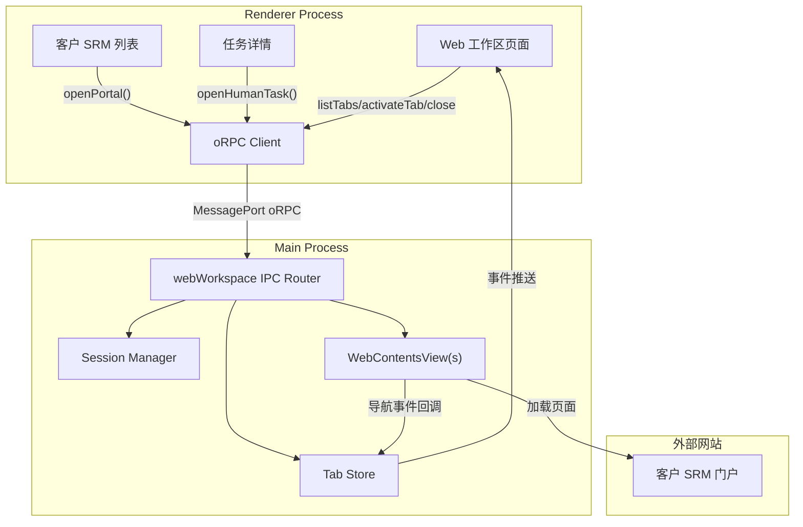

# v0.4 Electron WebContentsView Web 工作区实施计划

## 现状分析

当前项目（`autotask-studio`）使用 Electron + React + @orpc/server 架构：

- **IPC 模式**：基于 `@orpc/server` + `MessagePort`，Main 进程通过 `src/ipc/router.ts` 聚合路由模块，Renderer 通过 `src/ipc/manager.ts` 创建 RPC Client 调用
- **浏览器方案**：现有 `src/ipc/browser/handlers.ts` 通过 `child_process.spawn` 启动系统 Chrome/Edge 进程 + CDP 端口，需要整体替换为 WebContentsView
- **数据层**：Mock JSON + Zustand store + TanStack Query；`SRMPortal` 类型定义在 `src/types/srm-portal.ts`，`AutomationTask` 在 `src/types/automation-task.ts`
- **页面**：TanStack Router，侧边栏定义在 `src/components/layout/data/sidebar-data.ts`

## 核心改动

### 1. 数据模型调整

**`src/types/srm-portal.ts`** — 增加 `clientOpenMode`、`clientSessionPartition`、`serverRpaProfileId` 字段，移除与外部浏览器相关的 `browserType`、`runMode`、`profileId`、`profilePath` 等

**`src/types/automation-task.ts`** — 增加 `portalId`、`humanActionId`、`humanAction` 可选字段；状态已包含 `HUMAN_CONFIRMED`（需要加入）

**新增 `src/types/web-tab.ts`** — WebTab 接口

**新增 `src/types/human-action.ts`** — HumanAction 接口（替代现有 HumanCheckpoint，结构更清晰）

### 2. Mock 数据调整

- 更新 `src/mock/srm-portals.json` — 增加 `clientOpenMode`、`clientSessionPartition` 字段
- 新增 `src/mock/human-actions.json` — 人工动作数据
- 新增 `src/mock/web-tabs.json` — Tab 状态快照
- 更新 `src/services/mock-api.ts` — 增加 `getHumanAction`、`markHumanOpened`、`confirmHumanAction` 方法

### 3. Electron Main 进程 — WebContentsView 管理

替换现有 `src/ipc/browser/handlers.ts`（spawn 外部浏览器），新增 `src/ipc/web-workspace/` 模块：

```
src/ipc/web-workspace/
├── index.ts          (导出路由对象)
├── schemas.ts        (zod 输入校验)
├── handlers.ts       (WebContentsView 创建/销毁/导航)
├── tab-store.ts      (Tab 状态维护)
└── session-manager.ts(session partition 管理)
```

关键实现：
- `src/main.ts` 改为使用 `WebContentsView`（Electron 内嵌视图）
- 通过 `mainWindow.contentView.addChildView(webContentsView)` 管理子视图
- 每个 Tab 对应一个 WebContentsView 实例
- 使用 `session.fromPartition(partition)` 隔离客户登录态
- 监听 `did-navigate`、`page-title-updated`、`page-favicon-updated` 等事件
- 监听窗口 resize 更新 bounds

更新 `src/ipc/router.ts`：将 `browser` 替换/扩展为 `webWorkspace`

### 4. Renderer 端调用层

- 更新 `src/actions/browser.ts` -> `src/actions/web-workspace.ts`
- 提供 `openUrl`、`openPortal`、`openHumanTask`、`closeTab`、`activateTab`、`reload`、`goBack`、`goForward`、`listTabs` 等方法
- 由于使用 oRPC，Renderer 直接通过 `ipc.client.webWorkspace.xxx()` 调用

### 5. Web 工作区 UI 页面

新增路由 `/web-workspace`，页面组件：

```
src/features/web-workspace/
├── web-workspace-page.tsx  (主页面)
├── web-tab-bar.tsx         (Tab 栏)
├── web-toolbar.tsx         (导航工具栏：后退/前进/刷新/地址栏)
└── web-empty-state.tsx     (无 Tab 时的空状态)
```

布局说明：WebContentsView 由 Main 进程直接管理 bounds，覆盖在 Renderer 对应区域上方；Renderer 通过 IPC 发送容器尺寸信息给 Main 进程来同步 bounds。

### 6. 侧边栏 + 路由注册

- `src/components/layout/data/sidebar-data.ts` — 在"任务列表"下方增加 "Web 工作区" 菜单项
- `src/routes/web-workspace/index.tsx` — 路由文件
- `src/utils/routes.ts` 和 `routeTitles` 补充条目

### 7. 客户 SRM 页面改造

- `src/features/srm-portals/srm-portals-list.tsx` — 列表列调整（显示 clientOpenMode、sessionPartition），操作按钮改为调用 `webWorkspace.openPortal`
- `src/components/business/portal-actions.tsx` — 快速打开改为打开 WebContentsView Tab
- 移除与外部浏览器启动相关的逻辑

### 8. 任务页面改造

- `src/features/tasks/tasks-list.tsx` — WAITING_HUMAN 行增加【快速打开】按钮
- `src/features/tasks/task-detail.tsx` — 人工处理区域重构，使用 HumanAction 模型
- `src/components/business/task-actions.tsx` — 快速打开调用 `webWorkspace.openHumanTask`
- `src/components/business/human-checkpoint-panel.tsx` — 改造为人工处理面板，增加确认弹窗

### 9. 安全与配置

- WebContentsView 创建时设置 `contextIsolation: true`、`nodeIntegration: false`、不注入 preload
- URL 白名单校验（禁止 `file://`、`javascript:`、`data:` 协议）
- 系统设置页增加 Web 工作区配置项（默认打开方式、清理登录态）

## 架构数据流



## 需要注意的技术点

1. **WebContentsView bounds 同步**：Renderer 中 Web 工作区容器的位置/尺寸需要通过 IPC 通知 Main 进程，Main 进程调用 `view.setBounds()` 对齐。窗口 resize 时需要 debounce 更新。
2. **Tab 切换**：激活 Tab 时 `view.setVisible(true)` 当前 Tab，`setVisible(false)` 其他 Tab。
3. **事件推送**：Tab 状态变化（标题、URL、loading）需从 Main 推送到 Renderer。可通过 `mainWindow.webContents.send()` + 额外 IPC channel 实现，或使用 oRPC 的 subscription 能力。
4. **路由切换时隐藏**：当用户离开 `/web-workspace` 路由时，所有 WebContentsView 应 `setVisible(false)`；回来时恢复可见。

## 不做/保留

- 保留 `src/ipc/browser/` 模块但标记 deprecated（或直接删除，因为 v0.4 明确不再使用外部浏览器启动）
- 不实现 Playwright/CDP 自动化
- 不实现远程浏览器画面
- 不共享 Desktop 与 Server RPA 的 session
