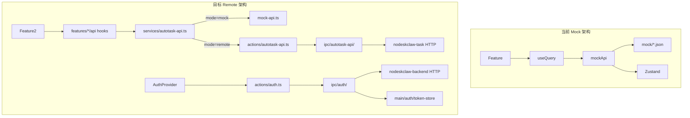
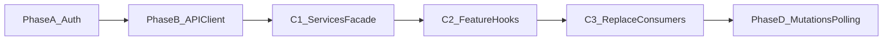

# v0.5 真实数据接口接入实施计划

## 现状摘要

| 维度 | 当前状态 |
|------|---------|
| 数据层 | 唯一入口 [`src/services/mock-api.ts`](src/services/mock-api.ts)，23 个方法 |
| 消费方 | 17 个文件直接 `import { mockApi }`（features + layout + business 组件） |
| Query Hooks | **无** `features/*/api/` 目录，组件内直接 `useQuery({ queryFn: mockApi.xxx })` |
| 认证 | **不存在**登录页、Auth Provider、Token 存储 |
| IPC | oRPC 模式，已有 `theme/window/app/shell/webWorkspace`，无 auth/api 模块 |
| Zustand | `task-store` / `settings-store` / `human-action-store` 仅在 mock-api 内部模拟持久化 |



## 架构决策

**遵循项目既有 oRPC 约定，不引入 PRD 中的 `window.autotaskAuth` / `window.autotaskApi`。** 等价能力通过 `ipc/` + `actions/` 实现，与 [`docs/IPC_CONTRACT.md`](docs/IPC_CONTRACT.md) 和 [`.cursor/rules/electron.mdc`](.cursor/rules/electron.mdc) 一致。

**Auth 包裹点：** 在 [`src/app.tsx`](src/app.tsx) 增加 `AutoTaskAuthProvider`（不修改 [`src/routes/__root.tsx`](src/routes/__root.tsx)）。

**API 模式开关：**

```ts
// src/services/endpoint-config.ts
export type ApiMode = 'mock' | 'remote'
export const getApiMode = () =>
  (import.meta.env.VITE_AUTOTASK_API_MODE ?? 'mock') as ApiMode
```

新增 `.env.development`：

```
VITE_AUTOTASK_API_MODE=mock   # 开发默认 mock，联调时改 remote
```

---

## Phase A：登录接入（nodeskclaw-backend）

### A1. Main 进程 Auth 基础设施

新建 `src/main/auth/`（HTTP 客户端与存储逻辑，被 IPC handler 调用）：

| 文件 | 职责 |
|------|------|
| `auth-client.ts` | `account-login` / `me` / `refresh` / `logout` HTTP 调用 |
| `token-store.ts` | keytar → safeStorage 文件 → 内存会话 三级降级 |
| `auth-endpoint-config-store.ts` | 持久化 endpoint 配置 |
| `nodeskclaw-auth-response.ts` | 响应类型 + DTO 映射 |
| `token-header-injector.ts` | 为业务请求附加 `Authorization` |

依赖：新增 `keytar`（配合 `@electron-forge/plugin-auto-unpack-natives` 已有配置）。

默认 endpoint（来自 PRD）：

```ts
authBackendUrl: 'http://127.0.0.1:4510'
authPrefix: '/api/v1/auth'
taskBackendUrl: 'http://127.0.0.1:4520'
taskPrefix: '/api/v1/autotask'
```

### A2. IPC Auth 模块

按 [`.cursor/skills/add-ipc/SKILL.md`](.cursor/skills/add-ipc/SKILL.md) 新增：

```
src/ipc/auth/
├── schemas.ts      # login/endpoint Zod schema
├── handlers.ts     # getState, saveEndpointConfig, login, logout, refresh
└── index.ts
```

注册到 [`src/ipc/router.ts`](src/ipc/router.ts)，新增 [`src/actions/auth.ts`](src/actions/auth.ts)。

**Public Auth State（Renderer 可见，不含 token）：**

```ts
interface PublicAuthState {
  status: 'loading' | 'authenticated' | 'unauthenticated'
  user?: { id: string; email: string; displayName: string }
  organization?: { id: string; name: string }
}
```

### A3. Renderer Auth 模块

```
src/modules/auth/
├── auth.types.ts
├── last-login-email.ts          # localStorage 记上次账号
├── AutoTaskAuthProvider.tsx     # 初始化 getState、登录态路由守卫
├── AutoTaskLoginScreen.tsx      # shadcn Card/Form 登录页
└── components/
    ├── LoginForm.tsx
    ├── EndpointConfigPanel.tsx  # 高级：endpoint 配置
    └── BootstrapScreen.tsx      # 登录后 bootstrap loading
```

**登录生命周期（复用 ai-os-desktop 模式）：**

1. `getState()` → 已登录进 AppShell，未登录进 LoginScreen
2. 提交 → `saveEndpointConfig()` → `login(email, password)` → `getState()` 更新
3. 401 → `refresh()` → 成功重放 / 失败清 session 回登录页
4. 登出 → `logout()` + 清理 web-workspace session

### A4. 验收

- nodeskclaw 账号可登录
- 刷新应用保持 session
- Token 过期自动 refresh
- Renderer 不持有 accessToken

---

## Phase B：API Client 接入（nodeskclaw-task）

### B1. Main 进程 HTTP 代理

```
src/main/autotask-api/
├── autotask-api-client.ts    # 通用 request(method, path, body)
├── autotask-api-errors.ts    # 401/403/500 统一错误类
└── autotask-api-retry.ts     # 401 触发 refresh + 重放
```

### B2. IPC Autotask API 模块

```
src/ipc/autotask-api/
├── schemas.ts     # request input: { method, path, body?, query? }
├── handlers.ts    # request handler，读 token-store 发 HTTP
└── index.ts
```

注册 router + [`src/actions/autotask-api.ts`](src/actions/autotask-api.ts) 封装 `requestAutotaskApi<T>(input)`。

### B3. Services 层重构

```
src/services/
├── endpoint-config.ts     # ApiMode + 默认 endpoint
├── api-client.ts          # 底层 IPC request 封装
├── query-keys.ts          # 集中管理 Query Key（从 DATA_FLOW 迁移）
├── dto-mappers.ts         # 后端 DTO → 前端 types/ 映射
├── mock-api.ts            # 保留不动，作为 mock 实现
├── remote-api.ts          # 调用 api-client 的真实 HTTP 方法
└── autotask-api.ts        # 统一门面 + mock/remote 切换
```

**`autotask-api.ts` 门面结构（对齐 PRD §8）：**

```ts
export const autotaskApi = {
  dashboard: { getSummary },
  tasks: { list, get, create, update, start, cancel, retry, confirmHumanAction },
  portalAccounts: { list, get, create, update, testOpen },
  workflowTemplates: { list, get },
  runs: { list, get, listEvents },
  artifacts: { list, getDownloadUrl },
  workers: { list },
  settings: { get, update },
  search: (query) => ...,
  // human action 映射到 tasks API
}
```

**Mock → Remote API 映射（PRD §9）：**

| mock-api 方法 | Remote Endpoint |
|--------------|-----------------|
| `getDashboard` | `GET /dashboard/summary` |
| `getTasks` / `getTaskById` | `GET /tasks` / `GET /tasks/:id` |
| `createTask` / `updateTask` | `POST /tasks` / `PATCH /tasks/:id` |
| `updateTaskStatus` (start/cancel/retry) | `POST /tasks/:id/start\|cancel\|retry` |
| `getWorkflowTemplates` | `GET /workflow-templates` |
| `getRuns` / `getRunById` | `GET /runs` / `GET /runs/:id` |
| `getSrmPortals` | `GET /portal-accounts` |
| `getWorkers` | `GET /rpa-workers` |
| `getArtifacts` | `GET /artifacts` |
| `getAuditLogs` | `GET /audit-logs` |
| `getSettings` | `GET /settings` |
| `getRpaComponents` | `GET /rpa-components` |
| `confirmHumanAction` | `POST /tasks/:id/confirm-human` |
| `markHumanOpened` | `POST /tasks/:id/human-opened` |

> **注意：** `dto-mappers.ts` 需对照 nodeskclaw-task 实际响应字段调整。若后端字段与 `src/types/` 有差异，在 mapper 层消化，不改 Feature 组件。

### B4. 统一错误处理

在 `api-client.ts` 中：
- **401** → 调 `auth.refresh()` → 重放一次 → 失败 toast + 跳转登录
- **403** → toast "权限不足"
- **500** → toast 显示服务端 message

### B5. 验收

- `VITE_AUTOTASK_API_MODE=mock` 行为与现在一致
- `VITE_AUTOTASK_API_MODE=remote` 访问 nodeskclaw-task
- 401 自动 refresh

---

## Phase C：页面数据源替换

### C1. 新增 Feature Query Hooks

按 PRD §10，为每个模块新增 `api/` 子目录：

```
src/features/dashboard/api/use-dashboard.ts
src/features/tasks/api/
  ├── use-tasks.ts, use-task.ts
  ├── use-create-task.ts, use-start-task.ts
  ├── use-cancel-task.ts, use-retry-task.ts
  └── use-confirm-human-action.ts
src/features/workflows/api/use-workflow-templates.ts, use-workflow-template.ts
src/features/portal-accounts/api/   # 对应 srm-portals feature
src/features/runs/api/use-runs.ts, use-run.ts, use-run-events.ts
src/features/artifacts/api/use-artifacts.ts
src/features/settings/api/use-settings.ts
```

Hook 模板：

```ts
export function useTasks(params?: TaskListParams) {
  return useQuery({
    queryKey: queryKeys.tasks.list(params),
    queryFn: () => autotaskApi.tasks.list(params),
  })
}
```

### C2. 逐文件替换 mockApi 引用

**必改 17 个消费方：**

| 文件 | 改动 |
|------|------|
| [`features/dashboard/index.tsx`](src/features/dashboard/index.tsx) | → `useDashboard`, `useTasks`, `useWorkers` |
| [`features/tasks/tasks-list.tsx`](src/features/tasks/tasks-list.tsx) | → `useTasks` |
| [`features/tasks/task-new.tsx`](src/features/tasks/task-new.tsx) | → `useCreateTask`, `usePortalAccounts`, `useWorkflowTemplates` |
| [`features/tasks/task-detail.tsx`](src/features/tasks/task-detail.tsx) | → `useTask`, `useRuns`, `useArtifacts`, `useAuditLogs` |
| [`features/workflows/workflows-list.tsx`](src/features/workflows/workflows-list.tsx) | → `useWorkflowTemplates` |
| [`features/workflows/workflow-detail.tsx`](src/features/workflows/workflow-detail.tsx) | → `useWorkflowTemplate` |
| [`features/srm-portals/srm-portals-list.tsx`](src/features/srm-portals/srm-portals-list.tsx) | → `usePortalAccounts` |
| [`features/srm-portals/srm-portal-detail.tsx`](src/features/srm-portals/srm-portal-detail.tsx) | → `usePortalAccount` |
| [`features/runs/runs-list.tsx`](src/features/runs/runs-list.tsx) | → `useRuns`, `useWorkers` |
| [`features/runs/run-detail.tsx`](src/features/runs/run-detail.tsx) | → `useRun`, `useArtifacts` |
| [`features/artifacts/index.tsx`](src/features/artifacts/index.tsx) | → `useArtifacts` |
| [`features/components/index.tsx`](src/features/components/index.tsx) | → `useRpaComponents` |
| [`features/settings/index.tsx`](src/features/settings/index.tsx) | → `useSettings`, `useUpdateSettings` |
| [`components/business/task-actions.tsx`](src/components/business/task-actions.tsx) | → mutation hooks |
| [`components/business/human-checkpoint-panel.tsx`](src/components/business/human-checkpoint-panel.tsx) | → `useConfirmHumanAction` |
| [`components/layout/page-layout.tsx`](src/components/layout/page-layout.tsx) | → `useWorkers` + 状态指示器 |
| [`components/layout/global-search.tsx`](src/components/layout/global-search.tsx) | → `autotaskApi.search` |

**不变：** UI 结构、DataTable columns、Sidebar、路由文件。

### C3. Zustand Store 角色调整

Remote 模式下：
- `task-store` / `human-action-store` **不再写入**（后端持久化）
- `settings-store` 中 `mockDelayMs` 仅 mock 模式生效；其余 settings 走后端 API
- mock 模式下 mock-api 继续用 store，保证离线演示

### C4. 验收

- 页面不再直接读 JSON
- 所有数据来自 query hook
- Query Key 与 [`docs/DATA_FLOW.md`](docs/DATA_FLOW.md) 约定保持一致

---

## Phase D：任务操作 + 轮询 + Header 状态

### D1. Mutation 接入

[`task-actions.tsx`](src/components/business/task-actions.tsx) 中 `updateTaskStatus` 拆分为语义化 mutation：

| 操作 | Remote API |
|------|-----------|
| 执行 | `POST /tasks/:id/start` |
| 取消 | `POST /tasks/:id/cancel` |
| 重试 | `POST /tasks/:id/retry` |
| 人工确认 | `POST /tasks/:id/confirm-human` |

每个 mutation `onSuccess` 执行 `invalidateQueries`（tasks、runs、dashboard）。

### D2. 轮询（PRD §12 第一期）

| 页面 | refetchInterval |
|------|----------------|
| Dashboard | 5s |
| Task Detail | 2s（task + run events） |
| Run Detail | 1s（run events） |

在对应 hook 中通过 `refetchInterval` 参数控制，mock 模式可关闭轮询。

### D3. Header 后端状态指示

扩展 [`page-layout.tsx`](src/components/layout/page-layout.tsx) / [`app-header.tsx`](src/components/layout/app-header.tsx)：

```
Auth: Logged in / Expired
Task API: Connected / Disconnected
Worker: Online / Busy / Offline（已有 WorkerStatusBadge，补充数据源）
```

新增 `useBackendStatus` hook，通过 auth state + 轻量 health check（如 `GET /dashboard/summary`）判断 Task API 连通性。

### D4. 验收

- 创建/执行/取消/重试任务写入后端
- WAITING_HUMAN 可打开 Web 工作区 + 确认完成
- Artifact 可查看 metadata 和下载链接
- 详情页刷新数据不丢失

---

## 实施顺序与依赖



建议按模块渐进替换（[`.cursor/skills/replace-mock-api/SKILL.md`](.cursor/skills/replace-mock-api/SKILL.md)）：

1. settings（最简单，验证链路）
2. dashboard
3. tasks（含 mutations）
4. workflows / runs / artifacts
5. srm-portals / components

---

## 风险与前置条件

1. **nodeskclaw-task API 契约：** 仓库内无 OpenAPI 文档，实施时需对照后端实际响应调整 `dto-mappers.ts`。建议先以 settings + dashboard 两个只读接口验证字段映射。
2. **keytar 原生模块：** Windows 打包需确认 `@electron-forge/plugin-auto-unpack-natives` 正确解包 keytar。
3. **登录阻塞：** remote 模式下所有业务 API 依赖 auth，Phase A 必须先完成。
4. **search 接口：** PRD 未列出独立 search endpoint，remote 模式可前端并行调 `tasks.list` + `workflowTemplates.list` 等做客户端过滤，或等后端提供 `GET /search?q=`。

---

## 不在本阶段范围

- SSE 实时事件（PRD 第二期）
- Local Agent / RPA Worker 接入（仅预留 IPC 扩展位）
- UI 布局重构
- 删除 `mock-api.ts`（保留为 fallback）
