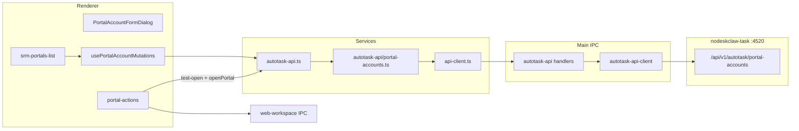

# v0.6 客户 SRM Portal Account 实施计划

## 现状与差距

**已有基础（可复用）：**
- Main 进程 HTTP 客户端：[`src/main/autotask-api/autotask-api-client.ts`](src/main/autotask-api/autotask-api-client.ts)（Bearer JWT、401 refresh）
- IPC 桥：[`src/ipc/autotask-api/`](src/ipc/autotask-api/)
- Remote/Mock 切换：[`src/services/autotask-api.ts`](src/services/autotask-api.ts) + [`src/services/remote-api.ts`](src/services/remote-api.ts)
- Portal GET 列表/详情 + Query hooks：[`src/features/srm-portals/api/use-portal-accounts.ts`](src/features/srm-portals/api/use-portal-accounts.ts)
- Web 工作区打开：[`src/actions/web-workspace.ts`](src/actions/web-workspace.ts) + [`src/ipc/web-workspace/`](src/ipc/web-workspace/)

**核心缺口：**
- 数据模型错位：UI 使用 `SRMPortal`（`customerName`/`name`/`url`/`enabled`），后端为 `PortalAccount`（`erpEntityName`/`portalName`/`portalUrl`/`ENABLED`）
- 仅 GET，无 POST/PATCH/DELETE/test-open
- 列表/详情仍展示 RPA 字段（locatorProfile、fieldMapping、serverRpaProfileId 等）
- `unwrapApiResponse` 不校验 `code !== 0`；`apiRequest` 未接入 remote 调用链
- IPC 错误 status 未透传到 Renderer（403 UI 降级无法工作）
- 代码默认 `mock` mode（[`src/types/endpoint-config.ts`](src/types/endpoint-config.ts) L20）



---

## 范围约定（已确认）

- **保留** `features/srm-portals` 目录与 `/srm-portals` 路由，不重命名 feature
- **跳过** Portal Access Grants（`listPortalAccessGrants` / `createPortalAccessGrant`）
- **不做** RPA Flow / WorkflowBinding / locatorProfile / 字段映射 / 自动登录

---

## P0：Remote 基线

### 1. 新增 `PortalAccount` 类型

新建 [`src/types/portal-account.ts`](src/types/portal-account.ts)：

```typescript
export type PortalEntityType = 'CUSTOMER' | 'SUPPLIER'
export type PortalStatus = 'ENABLED' | 'DISABLED'
export type ClientOpenMode = 'webcontents' | 'system_browser'

export interface PortalAccount { /* PRD §6 字段 */ }
export type CreatePortalAccountInput = Omit<PortalAccount, 'id' | 'tenantId' | 'createdBy' | 'createdAt' | 'updatedAt'>
export type UpdatePortalAccountInput = Partial<Pick<PortalAccount, 'portalName' | 'portalUrl' | 'loginAccount' | 'clientOpenMode' | 'clientSessionPartition' | 'status' | 'erpEntityName' | 'erpEntityCode'>>
```

[`src/types/srm-portal.ts`](src/types/srm-portal.ts) 保留但标记 `@deprecated`，逐步移除引用。

### 2. 强化 Response 解包

扩展 [`src/services/dto-mappers.ts`](src/services/dto-mappers.ts)：

- 导出 `ApiResponse<T>` 与 `unwrapApiResponse()`（`code !== 0` 抛 `Error`）
- 让 `mapListResponse` / `mapItemResponse` 内部先走 `unwrapApiResponse`
- 新增 `mapPortalAccount()` / `mapPortalAccountList()` 做字段归一化（兼容 mock 旧字段名 → 新字段名）

### 3. 新建 Portal Accounts Service 模块

新建 [`src/services/autotask-api/portal-accounts.ts`](src/services/autotask-api/portal-accounts.ts)：

| 函数 | HTTP |
|------|------|
| `listPortalAccounts()` | GET `/portal-accounts` |
| `getPortalAccount(id)` | GET `/portal-accounts/{id}` |
| `createPortalAccount(input)` | POST `/portal-accounts` |
| `updatePortalAccount(id, patch)` | PATCH `/portal-accounts/{id}` |
| `deletePortalAccount(id)` | DELETE `/portal-accounts/{id}` |
| `testOpenPortalAccount(id)` | POST `/portal-accounts/{id}/test-open` |

全部通过 `apiRequest` 调用（非直接 `requestAutotaskApi`）。

### 4. 修复错误透传链

[`src/ipc/autotask-api/handlers.ts`](src/ipc/autotask-api/handlers.ts)：catch `AutotaskApiError`，以带 `status`/`body` 的结构化错误抛出（oRPC `ORPCError` 或自定义序列化字段）。

[`src/actions/autotask-api.ts`](src/actions/autotask-api.ts)：解析 IPC 错误，还原为 `ApiClientError(status, body)`。

[`src/services/remote-api.ts`](src/services/remote-api.ts)：portal 相关方法改为委托 `portal-accounts.ts`；其余方法可后续逐步迁移，本次至少 portal 走 `apiRequest`。

### 5. 默认 Remote Mode

- [`src/types/endpoint-config.ts`](src/types/endpoint-config.ts)：`getApiMode()` 默认值改为 `"remote"`
- 新增 [`.env.production`](.env.production)：`VITE_AUTOTASK_API_MODE=remote`
- Mock 仅在 `VITE_AUTOTASK_API_MODE=mock` 时启用

### 6. 更新 Facade 与 Mock

[`src/services/autotask-api.ts`](src/services/autotask-api.ts) 扩展 `portalAccounts`：

```typescript
portalAccounts: {
  list, get, create, update, delete, testOpen
}
```

[`src/services/mock-api.ts`](src/services/mock-api.ts)：为 portal 增加内存 CRUD + `testOpen` stub；[`src/mock/srm-portals.json`](src/mock/srm-portals.json) 字段对齐 `PortalAccount`（或 mapper 做兼容转换）。

---

## P1：客户 SRM CRUD UI

### 1. Mutation Hooks

在 [`src/features/srm-portals/api/`](src/features/srm-portals/api/) 新增：

- `use-create-portal-account.ts`
- `use-update-portal-account.ts`
- `use-delete-portal-account.ts`
- `use-disable-portal-account.ts`（PATCH `status: DISABLED` 的便捷封装）

模式参考 [`src/features/tasks/api/use-task-mutations.ts`](src/features/tasks/api/use-task-mutations.ts)，成功后 `invalidateQueries(queryKeys.portalAccounts.*)` + toast。

### 2. 表单弹窗 `PortalAccountFormDialog`

新建 [`src/features/srm-portals/components/portal-account-form-dialog.tsx`](src/features/srm-portals/components/portal-account-form-dialog.tsx)：

- 模式：`create` | `edit`
- 字段按 PRD §8/§9：客户编码/名称、门户名称/地址、登录账号、打开方式、Session 分区、状态
- 新建默认：`entityType: CUSTOMER`、`clientOpenMode: webcontents`、`status: ENABLED`
- Session 分区：用户可留空，前端生成 `persist:portal-{erpEntityCode}` 作为 fallback
- 编辑时 `erpEntityCode` 只读或带警告
- 422 错误：解析 `body` 字段映射到表单 inline 提示

### 3. 列表页改造

改造 [`src/features/srm-portals/srm-portals-list.tsx`](src/features/srm-portals/srm-portals-list.tsx)：

**顶部工具栏：**
- 搜索框（关键字过滤 `erpEntityCode` / `erpEntityName` / `portalName` / `loginAccount`）
- 状态筛选（全部 / ENABLED / DISABLED）
- 打开方式筛选
- 刷新按钮
- `+ 新增 SRM` 按钮 → 打开 FormDialog

**表格列（PRD §7）：** 客户编码、客户名称、门户名称、门户地址（truncate）、登录账号、打开方式、状态、更新时间、操作

**移除列：** serverRpaProfileId、loginType、loginState、lastOpenedAt、Session 分区（列表可不展示）

**行操作：** 打开 / 编辑 / 禁用 / 删除（删除用 [`ConfirmDialog`](src/components/common/confirm-dialog.tsx) 二次确认）

**状态处理：** loading（`MockLoading`）、error（`EmptyState` + 重试）、empty

### 4. 详情页瘦身

改造 [`src/features/srm-portals/srm-portal-detail.tsx`](src/features/srm-portals/srm-portal-detail.tsx)：

- 移除 Tab：登录配置、页面定位器、字段映射、测试记录
- 单卡片只读展示 PRD §6 字段
- 右上角：编辑按钮 + 精简版 `PortalActions`
- 字段改用 `portalName` / `erpEntityName` / `portalUrl` 等

### 5. 更新关联消费者

| 文件 | 改动 |
|------|------|
| [`src/features/tasks/task-new.tsx`](src/features/tasks/task-new.tsx) | `PortalAccount` 字段；过滤 `status === 'ENABLED'`；显示 `portalName` |
| [`src/components/layout/global-search.tsx`](src/components/layout/global-search.tsx) | 搜索字段改为 `portalName`/`erpEntityName` |
| [`src/components/business/portal-actions.tsx`](src/components/business/portal-actions.tsx) | 类型改为 `PortalAccount`；移除「测试打开(loginPageUrl)」 |
| [`src/components/business/task-actions.tsx`](src/components/business/task-actions.tsx) | `portalUrl`/`portalName` |
| [`src/components/business/human-checkpoint-panel.tsx`](src/components/business/human-checkpoint-panel.tsx) | 同上 |
| [`src/components/business/srm-portal-card.tsx`](src/components/business/srm-portal-card.tsx) | 对齐新字段（如仍保留） |

---

## P2：快速打开

改造 [`src/components/business/portal-actions.tsx`](src/components/business/portal-actions.tsx) 的 `handleOpen`：

```
1. 检查 portal.status === 'ENABLED'，否则 toast 并 return
2. await autotaskApi.portalAccounts.testOpen(portal.id)   // 审计
3. 按 clientOpenMode：
   - system_browser → openExternal(portal.portalUrl)
   - webcontents → openPortal({ portalId, url: portal.portalUrl, title: portal.portalName, sessionPartition, openMode })
4. navigate('/web-workspace')
5. invalidate portal detail query（刷新 updatedAt / lastOpenedAt 如有）
```

403 时 toast「权限不足」，不禁用按钮（P3 处理）。

保留「重置本地登录态」作为辅助操作（PRD 未禁止，现有能力可复用）。

---

## P3：权限与体验

### 1. 403 权限降级

新建 hook [`src/features/srm-portals/hooks/use-portal-write-permission.ts`](src/features/srm-portals/hooks/use-portal-write-permission.ts)：

- 首次 CRUD mutation 遇 403 时设置 `canWrite = false`
- 列表页隐藏「+ 新增 SRM」、行内编辑/禁用/删除
- 详情页隐藏编辑按钮

（若后端后续提供权限 probe 接口可替换；当前以 mutation 403 信号为准。）

### 2. 错误码处理

| 状态 | 行为 |
|------|------|
| 401 | `apiRequest` → `refreshAuth` → 失败跳转登录（已有 `AutoTaskAuthProvider`） |
| 403 | toast + UI 降级 |
| 404 | 详情 `EmptyState`；删除后 redirect 列表 |
| 422 | 表单字段级错误 |
| 500 | toast，保留当前页 |

---

## 测试

按 [testing rule](.cursor/rules/testing.mdc) 补充：

- [`src/tests/unit/dto-mappers.test.ts`](src/tests/unit/dto-mappers.test.ts)：`unwrapApiResponse` 在 `code !== 0` 时抛错
- 新建 `src/tests/unit/portal-accounts.test.ts`：mock CRUD + mapper 字段映射
- 更新 [`src/tests/unit/autotask-api.test.ts`](src/tests/unit/autotask-api.test.ts)：验证 facade 暴露 create/update/delete/testOpen

---

## 关键文件清单

| 操作 | 文件 |
|------|------|
| 新建 | `src/types/portal-account.ts` |
| 新建 | `src/services/autotask-api/portal-accounts.ts` |
| 新建 | `src/features/srm-portals/components/portal-account-form-dialog.tsx` |
| 新建 | `src/features/srm-portals/api/use-*-portal-account.ts`（3-4 个 mutation hooks） |
| 新建 | `src/features/srm-portals/hooks/use-portal-write-permission.ts` |
| 新建 | `.env.production` |
| 改造 | `dto-mappers.ts`, `api-client.ts`, `autotask-api.ts`, `remote-api.ts`, `mock-api.ts` |
| 改造 | `ipc/autotask-api/handlers.ts`, `actions/autotask-api.ts` |
| 改造 | `srm-portals-list.tsx`, `srm-portal-detail.tsx`, `portal-actions.tsx` |
| 改造 | `task-new.tsx`, `global-search.tsx`, `endpoint-config.ts` |
| 更新 Mock | `src/mock/srm-portals.json` |

---

## 验收对照（PRD §14）

1. 启动后默认 remote 连接 nodeskclaw-task
2. 客户 SRM 不再直接读 `srm-portals.json`（remote 模式）
3. 列表来自 GET `/portal-accounts`
4. 新增 POST 成功 + toast + 刷新
5. 编辑 PATCH 成功
6. 删除 DELETE 成功 + 刷新
7. 打开先 test-open 再 Web 工作区
8. 401 触发刷新登录态
9. 403 权限不足 + UI 降级
10. DISABLED Portal 不可打开
11. 页面无 RPA/WorkflowBinding/locatorProfile 入口
